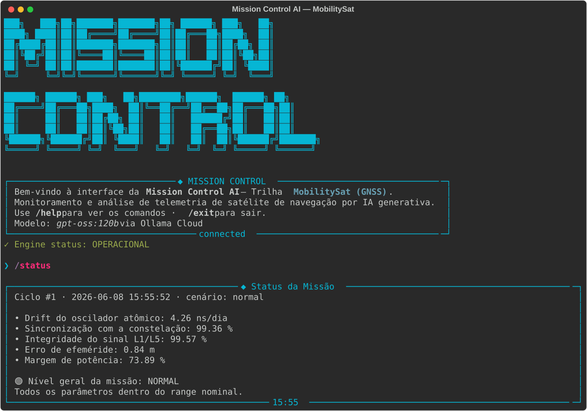
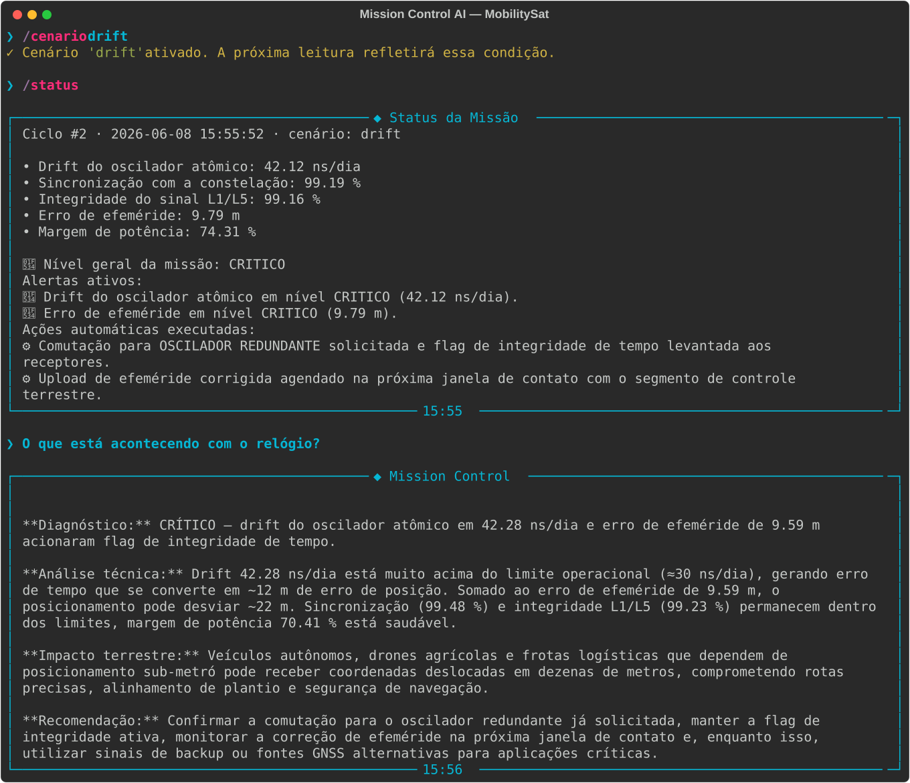

# Mission Control AI — MobilitySat (GNSS)

Sistema de monitoramento operacional de um **satélite GNSS de navegação** (estilo GPS/Galileo).
Recebe telemetria simulada, detecta anomalias via lógica Python e usa IA generativa
(Ollama Cloud · `gpt-oss:120b`) para traduzir cada anomalia em **impacto terrestre** para
frotas logísticas, agricultura de precisão e veículos autônomos.

## Integrantes - CPPR
- Alice Lima — RM: 567371 
- Carlos Raul  — RM: 567798 
- Jessica Xavier — RM: 568173 

## O que o projeto faz
A Mission Control AI monitora cinco parâmetros de um satélite GNSS (drift do oscilador
atômico, sincronização com a constelação, integridade do sinal L1/L5, erro de efeméride e
margem de potência). Uma camada de **regras de decisão em Python** classifica cada leitura
em NORMAL / ATENÇÃO / CRÍTICO e dispara respostas automatizadas (modo economia, comutação
para oscilador redundante, RAIM). O **LLM via Ollama Cloud** recebe esses dados injetados
dinamicamente no prompt e gera uma análise em linguagem natural, sempre amarrando a condição
técnica ao impacto no usuário terrestre.

## Persona atendida
**Operador de centro de controle / engenheiro de segmento espacial.** É quem fica de plantão
no NOC observando a saúde do satélite e precisa de diagnóstico técnico rápido e acionável —
por isso a IA responde em formato fixo (Diagnóstico → Análise → Impacto → Recomendação), com
tom de controlador de missão.

## Tecnologias utilizadas
- Python 3.10+
- Ollama Cloud API (modelo `gpt-oss:120b`)
- Bibliotecas: `ollama`, `python-dotenv`, `rich`, `prompt-toolkit`, `pyfiglet`

## Como executar
1. Clone o repositório.
2. Crie o ambiente virtual:
   ```bash
   python -m venv .venv && source .venv/bin/activate   # Windows: .venv\Scripts\activate
   ```
3. Instale as dependências:
   ```bash
   pip install -r requirements.txt
   ```
4. Crie um arquivo `.env` na raiz com sua chave da Ollama Cloud:
   ```
   OLLAMA_API_KEY=sua_chave_aqui
   ```
5. Execute:
   ```bash
   python main.py
   ```

### Comandos da CLI
| Comando | Descrição |
|---|---|
| `/help` | Lista os comandos |
| `/status` | Snapshot da telemetria + alertas ativos |
| `/cenario <nome>` | Força um cenário: `normal`, `drift`, `sync`, `energia`, `apagao` |
| `/about` | Sobre o sistema |
| `/clear` | Limpa a tela |
| `/exit` | Encerra |
| `<pergunta>` | Qualquer texto vira uma análise da IA |

## 📸 Demonstração



## 🤖 System Prompt
O system prompt completo está em [`prompts/system_prompt.md`](prompts/system_prompt.md).
Ele define papel (analista de bordo GNSS), escopo, restrições (não reclassificar severidade,
não inventar dados), tom e formato de saída fixo, além de dois exemplos few-shot.

## Cenários de teste demonstrados
1. **Operação normal** — todos os parâmetros dentro do range; IA recomenda manter monitoramento.
2. **Drift crítico do oscilador** (`/cenario drift`) — alerta CRÍTICO + comutação automática para
   oscilador redundante + análise da IA sobre o erro de posicionamento resultante.
3. **Perda de sincronização** (`/cenario sync`) — RAIM acionado, satélite marcado como não-utilizável.
4. **Baixa energia** (`/cenario energia`) — modo economia ativado automaticamente.
5. **Apagão total** (`/cenario apagao`) — todos os parâmetros críticos simultaneamente.

## Diferenciais implementados
- **Memória de contexto:** o motor guarda os últimos 5 ciclos e injeta um resumo no prompt,
  dando à IA consciência temporal da evolução da missão.
- **Few-shot prompting:** o system prompt traz exemplos de análise (nominal e crítica) que
  estabilizam o formato e a qualidade das respostas.
- **Saída/decisão estruturada:** toda a classificação de severidade e as respostas automatizadas
  são lógica Python pura — a IA explica, não decide.

## Proposta de valor / modelo de negócio
**1. Qual o problema real terrestre que esta missão resolve?**
Posicionamento de alta precisão é insumo crítico para logística, agricultura de precisão e
veículos autônomos. Quando o sinal GNSS degrada sem aviso, frotas erram rotas, plantadeiras
autônomas saem da linha e sistemas autônomos perdem a referência de segurança. O sistema garante
que a degradação seja detectada, comunicada e mitigada antes de virar erro no campo.

**2. Quem paga pela solução?**
Modelo **híbrido**. O segmento espacial é tipicamente público/concessão (uma agência como a AEB
ou um consórcio internacional opera a constelação), mas o serviço de *integridade e correção*
(camada que este sistema representa) é vendido a clientes privados — operadoras logísticas,
cooperativas agrícolas e fabricantes de veículos autônomos que precisam de garantia de precisão.

**3. Métrica de impacto (satélite 100% saudável por 1 ano):**
Cerca de **1,2 milhão de hectares** de agricultura de precisão operando com correção sub-métrica
confiável e aproximadamente **15 mil veículos de frota** com roteamento otimizado — reduzindo
retrabalho de aplicação de insumos e quilômetros rodados a mais. (Número plausível de
ordem de grandeza, não medição exata.)

**4. Modelo de negócio:**
**Dado-como-serviço (DaaS) por assinatura** — clientes pagam mensalidade por nível de integridade
e precisão garantidos (SLA), com a Mission Control AI atuando como camada de monitoramento e
alerta que sustenta esse SLA.

## Limitações conhecidas
- A telemetria é simulada estocasticamente — não reflete física orbital real.
- A IA é não-determinística; mesmo com `temperature=0.3`, respostas variam levemente entre execuções.
- Não há persistência em disco do histórico entre sessões (memória vive apenas no processo).
- Depende de conexão com a Ollama Cloud; sem chave válida, o motor retorna mensagem de erro amigável.

## Vídeo de demonstração
🔗 [Assistir demonstração no YouTube](https://www.youtube.com/watch?v=8_BZFhLPkbs)
> Configurado como "Não listado" no YouTube.
